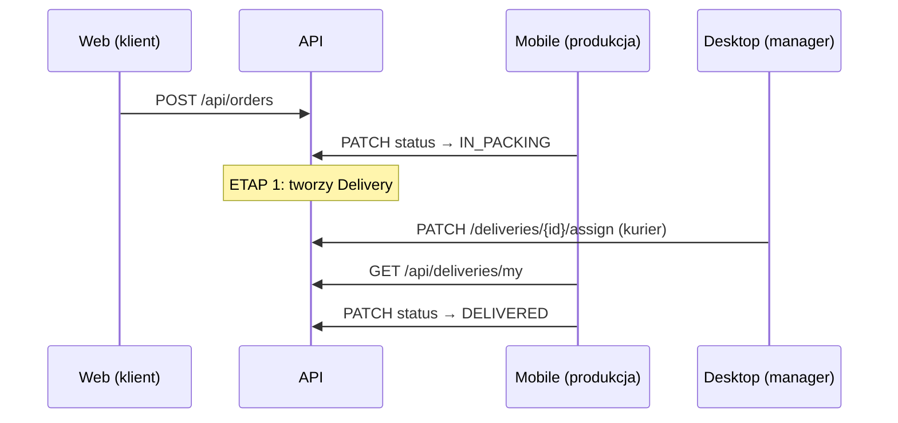

# Integracja zespołu — API (szkic)

> **Status:** dokument roboczy. Mapowanie statusów i flow dostaw **czeka na odpowiedź zespołu** (Faza 0). Po „OK” wdrożymy ETAP 1 w backendzie i zaktualizujemy ten plik.

**Produkcja:** `https://api-alcozon.onrender.com`  
**Swagger:** `/docs`  
**Health (bez auth):** `GET /actuator/health`

---

## Konta demo (po migracji Flyway / DataInitializer)

| Rola | E-mail | Hasło |
|------|--------|--------|
| Manager | `manager@example.com` | `Manager123!` |
| Pracownik | `employee@example.com` | `Employee123!` |

Klienci: rejestracja `POST /api/auth/register` lub gość `POST /api/auth/guest`.

---

## Słownik statusów zamówienia (`OrderStatus`)

| Status API | Znaczenie (propozycja) | Uwagi |
|------------|------------------------|--------|
| `SUBMITTED` | Złożone | Push FCM do staff przy nowym zamówieniu |
| `IN_PRODUCTION` | W produkcji | |
| `IN_PACKING` | Pakowanie / **propozycja: „gotowe do wysyłki”** | **Do potwierdzenia (Michał)** |
| `IN_DELIVERY` | W dostawie | Dziś: `Delivery` tworzy się przy wejściu w ten status |
| `DELIVERED` | Dostarczone | |
| `CANCELLED` | Anulowane | |

**Planowany ETAP 1 (po OK zespołu):** utworzenie rekordu `Delivery` przy `IN_PACKING`; `PATCH /api/deliveries/{id}/assign` tylko dla `MANAGER`.

---

## Flow dostaw (docelowy — szkic)

**Stan API dziś:** `Delivery` powstaje przy przejściu zamówienia na `IN_DELIVERY`; przypisanie kuriera: `EMPLOYEE` lub `MANAGER`.

---

## Endpointy kluczowe dla integracji

### Auth
- `POST /api/auth/login` — body: `{ "email", "password" }` → `accessToken`, `refreshToken`, `firstName`, `lastName`
- `POST /api/auth/refresh` — `{ "refreshToken" }`
- `GET /api/users/me` — Bearer

### Katalog (publiczne)
- `GET /api/products?page=0&size=20&q=...`

### Zamówienia
- Klient: `POST /api/orders`, `GET /api/orders/my`
- Staff: `GET /api/orders`, `PATCH /api/orders/{id}/status`
- Publiczne śledzenie: `GET /api/orders/track?orderId=&email=` (rate limit 30/min/IP)

### Dostawy
- `GET /api/deliveries` — manager/staff
- `GET /api/deliveries/my` — kurier (`is_courier` / rola)
- `PATCH /api/deliveries/{id}/assign` — body: `{ "courierUserId" }`
- `PATCH /api/deliveries/{id}/status` — `DELIVERED` synchronizuje zamówienie

### Realtime
- STOMP `ws(s)://host/ws`, subskrypcja `/user/queue/order-updates`, nagłówek CONNECT: `Authorization: Bearer <token>`

### Push (opcjonalnie)
- `POST /api/devices/fcm` — rejestracja tokenu (staff)

---

## CORS / env na Renderze

- `APP_CORS_ALLOWED_ORIGINS` — np. `https://web-alkozon.vercel.app`
- `JWT_SECRET` — wymagane na prod
- `FIREBASE_SERVICE_ACCOUNT_JSON` — push (opcjonalnie)
- `PORT` — ustawiane przez Render; aplikacja: `server.port=${PORT:8080}`

---

## Faza 2 (nie w MVP — wymaga decyzji)

- Logowanie staff: `deviceId` + 4-cyfrowy kod e-mail (SMTP, nowe endpointy)
- Współrzędne GPS w API (dziś tylko `deliveryAddress` tekst)

---

## Narzędzia (backend)

- **CI:** GitHub Actions — `mvn verify` + profil `test` + Testcontainers (PostgreSQL).
- **Smoke prod:** `.\scripts\smoke-prod.ps1` (health, produkty, login manager/employee, dostawy).

---

## Checklist integracji per klient

| Klient | URL prod | Priorytet |
|--------|----------|-----------|
| Web (Kuba) | już Vercel + CORS | ikony produktów, FCM opcjonalnie |
| Mobile (Michał) | podmiana base URL | zamówienia + dostawy z API (dziś mock) |
| Desktop (Bartek) | prod API | assign kuriera, test manager/employee |
